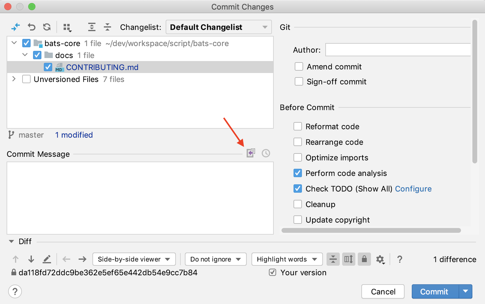

## Constants
- THIS_SCRIPT_NAME: the main script name
- SED_NEW_LINE: return and new line, used with sed
- COLOR_BOLD_BLACK: Header
- COLOR_BOLD_RED: Error, KO
- COLOR_BOLD_GREEN: OK
- COLOR_BLUE: Value
- COLOR_END: for others, reset to default
## Functions string_xxx
Usage:
string_length " as fd "
string_length < logfile
echo " add " | string_length
Usage:
string_sub " as fd " 2
string_sub < logfile
echo " add " | string_sub
Usage:
string_before_first " as fd " "s f"
string_before_first "str" < logfile
echo " add " | string_before_first "str"
Usage:
string_after_first " as fd " "s f"
string_after_first "token" < logfile
echo " add " | string_after_first "token"
Usage:
string_index_first " as fd " "s f"
string_index_first "token" < logfile
echo " add " | string_index_first "token"
Return:
the positive index of first place of token in string, -1 if not existed
Usage:
escape preserved char of regex, normally for preprocess of sed token
escape_sed 'a$'
Usage:
string_replace 'a' 'b' 'aaa'   ==> 'bbb'
string_replace '$' 'b' 'a$a'   ==> 'aba'
string_replace '\*' 'b' 'a*a'  ==> 'aba'
Usage:
string_replace_regex 'a*' 'b' 'a*a' ==> 'b*b'
string_replace_regex 'a*' 'b' "aaa" ==> 'b'
string_replace_regex '*' 'b' 'a*a'  ==> 'aba'
Usage:
str="a|b|c"
string_split_to_array '|' newArray "$str"

branchesToSelectString=$(git branch -r --list  'origin/*')
string_split_to_array $'\n' branchesToSelectArray "${branchesToSelectString}"
## Functions array_xxx
Usage:
array_join '|' "${branchesToSelect3[
##### ]}"
Usage:
array_describe arrayVarName
Usage:
arr=("a" "b" "c" "ab" "f" "g")
array_contains arr "ab"

array_contains ${validValuesVarName} ${value}
Usage:
arr=("a" "b" "c" "ab" "f" "g")
array_remove arr "ab"

array_remove ${validValuesVarName} ${value}
Usage:
arr=(" a " " b c ")
array_map arr newArray "string_trim | wc -m | string_trim"
declare -p newArray
Usage:
array_append myarr "ele ment1" "ele ment2"
array_append myarr "ele ment3" "ele ment4"
## Functions args_xxx
Usage:
args_parse $# "$
##### " positionalVarName1 positionalVarName2 ...
Usage:
show the name and value of variables
var1="value 1"
var2="value 2"
args_print var1 var2
Usage:
arr=("a" "b" "c" "ab" "f" "g")
value="abc"
args_valid_or_select value arr "Which app"
declare -p value
Usage:
sel="abc"
args_valid_or_select_pipe sel "a|ab|d" "which value"
Usage:
args_valid_or_read destProjectSIA '^[0-9a-z]{3,3}$' "SIA (lowercase, 3 chars)"
args_valid_or_read destProjectIRN '^[0-9]{5,5}$' "IRN (only the 5 digits)"
args_valid_or_read destRootPackage '^.+$' "Destination root package" "${defaultDestRootPackage}"
Usage:
a="correct value"
b="wrong value"
args_confirm a b
## Functions others
Usage:
print_header "My header1"
print_header My header2
Usage:
'trap' or 'set -e' is not recommended
rm -fr "${destProjectPath}"
stop_if_failed "ERROR: can't delete the directory '${destProjectPath}' !"
Usage:
declare_heredoc varName <<-EOF
...
EOF

---

##### NAME
string_trim -- remove the white chars from prefix and suffix

##### SYNOPSIS
string_trim string

##### DESCRIPTION


##### EXAMPLES
string_trim " as fd "
string_trim < logfile
echo " add " | string_trim

##### SEE_ALSO
